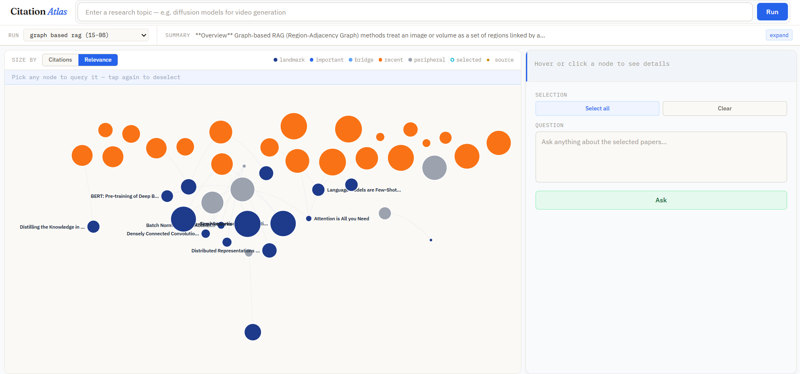

# 🧭 Citation Atlas

Citation Atlas is an interactive research exploration and question-answering system that builds citation graphs from academic papers and enables context-grounded answers using Retrieval-Augmented Generation (RAG).

It combines **ArXiv (for reliable PDFs)** and **Semantic Scholar (for citation relationships)** to create a structured, visual, and queryable map of research.

---

## 🚀 Features

| Feature                 | Description                                             |
| ----------------------- | ------------------------------------------------------- |
| 🔍 Citation Graph       | Builds graph where nodes = papers and edges = citations |
| 📄 ArXiv-first Pipeline | Reliable PDF retrieval with fallback support            |
| 🧠 RAG-based QA         | Answers grounded strictly in retrieved paper content    |
| ⚡ Multi-LLM Support    | Supports Groq, Gemini, OpenRouter                       |
| 📊 Interactive UI       | Visual graph + paper selection + QA panel               |

---

## 🖼️ UI Preview


<p align="center">
  
</p>

---

## 🏗️ System Architecture

```
User Query
   ↓
Query Expansion
   ↓
ArXiv (Seed Papers)
   ↓
Semantic Scholar (References)
   ↓
PDF Download (ArXiv-first)
   ↓
Text Extraction + Chunking
   ↓
Embeddings (MiniLM)
   ↓
ChromaDB (Vector DB)
   ↓
Graph (NetworkX)
   ↓
Frontend (D3.js) + QA
```

---

## 🛠️ Tech Stack

### Backend

| Component   | Technology |
| ----------- | ---------- |
| Framework   | FastAPI    |
| Graph       | NetworkX   |
| PDF Parsing | PyMuPDF    |
| Language    | Python     |

---

### Embeddings & RAG

| Component  | Technology                                  |
| ---------- | ------------------------------------------- |
| Embeddings | SentenceTransformers (`all-MiniLM-L6-v2`) |
| Vector DB  | ChromaDB                                    |

---

### APIs

| API              | Purpose               |
| ---------------- | --------------------- |
| ArXiv            | Seed papers + PDFs    |
| Semantic Scholar | References + metadata |

---

### LLM Providers

| Provider   | Role                      |
| ---------- | ------------------------- |
| Groq       | Fast inference            |
| Gemini     | Balanced responses        |
| OpenRouter | Access to multiple models |

---

### Frontend

| Component     | Technology            |
| ------------- | --------------------- |
| UI            | HTML, CSS, JavaScript |
| Visualization | D3.js                 |

---

## ⚙️ Setup Instructions

### 1. Clone Repository

```bash
git clone https://github.com/Sha5hank007/citation-atlas.git
cd citation-atlas_project
```

---

### 2. Create Virtual Environment

```bash
python -m venv .venv
.venv\Scripts\activate
```

---

### 3. Install Dependencies

```bash
pip install -r requirements.txt
```

---

### 4. Configure Environment Variables

Create `.env` file:

```env
GROQ_API_KEY=your_key
GEMINI_API_KEY=your_key
OPENROUTER_API_KEY=your_key

LLM_PROVIDER=groq
```

---

## ▶️ Run the Project

```bash
uvicorn backend.server:app --reload
```

Open in browser:

```
http://127.0.0.1:8000
```

---

## 🧪 How It Works

| Step | Description                                   |
| ---- | --------------------------------------------- |
| 1    | Enter a research topic                        |
| 2    | System fetches papers and builds graph        |
| 3    | PDFs are downloaded and processed             |
| 4    | Graph is rendered in UI                       |
| 5    | User selects papers and asks questions        |
| 6    | RAG retrieves chunks and LLM generates answer |

---

## 📊 Graph Interpretation

| Element   | Meaning                            |
| --------- | ---------------------------------- |
| Nodes     | Research papers                    |
| Edges     | Citation relationships             |
| Node Size | Importance (citations / relevance) |

---

## ⚡ Key Design Decisions

- **ArXiv-first retrieval** → ensures high PDF success rate
- **Semantic Scholar for references** → richer citation graph
- **Chunk-based embeddings** → better retrieval granularity
- **Paper-level filtering** → precise QA responses

---

## ⚠️ Limitations

- Not all papers have accessible PDFs
- Some references may lack ArXiv mapping
- Graph density depends on reference overlap

---
